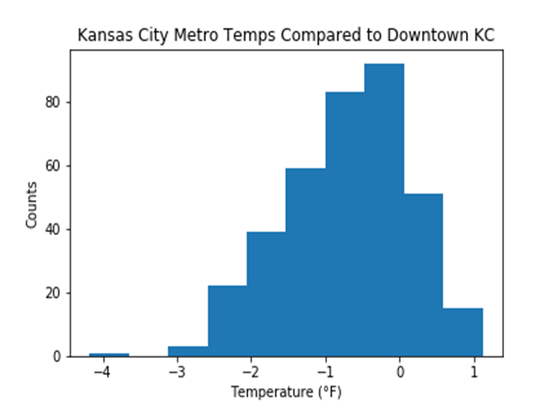
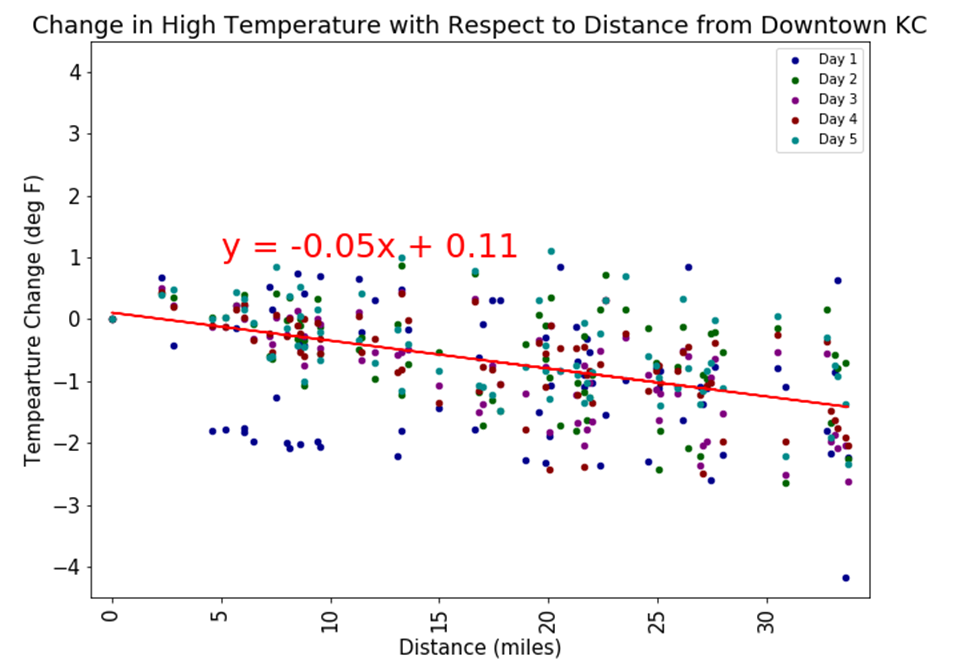

# ProjectOne

Is there a correlation between unemployment and migration against humidity and temperature over time? Does this make Kansas or the United States a great place to live? The data shows Kansas is consistently lower in unemployment than the national United States average over a twenty-year period (2000-2020). Unemployment and migration are visually poorly correlated in Kansas during 2018. Future directions of multiple representative (possibly by grouped regions) linear trends tracking an index of unemployment and migration, possibly along with other related variables, over time is required to surface trends. The ten most populous cities in the United States, based on a Google Search, did not show a strong correlation between unemployment and temperature and humidity. More information might provide value based on demographic grouping and environmental preferences along with expanding the dataset population to include the world.  

Is the temperature of a city metropolitan area hottest downtown?
    The average temperature within 30 miles of downtown Kansas City, MO is on average 0.7 degrees cooler than downtown KC, with a mode of 0.6 degrees cooler and a standard deviation of 0.84.  Temperatures as you travel a distance away from Kansas City, MO decrease slightly the further you are from the city, but with an r squared correlation of 0.24, there is no true correlation between distance from KC, MO and temperature within the KC metropolitan area.  

How are levels of employment and unemployment in Kansas (2014-2019) to recognize how extent was opportunities in that time? And Is there was a correlation between poverty rate and household income in 2018? based on the he data shows Kansas is recorded decreased figures   in unemployed and unemployment average rate through last six years from 2014-2019 respectively. In contrast, employed in Kansas was dramatically increased in last three years from 2017 to 2019, but, in previous years from 2014-2017 it slightly increased from over1.422.500 person had a job to 1.4275.00 employed in 2014-2015. Then it dropped down in the next following years till 2017. On the other hand, it is clear to show from scotter plot that there was zero possibility of correlation between median house hold income and poverty in 2018.

 

 
 
 
